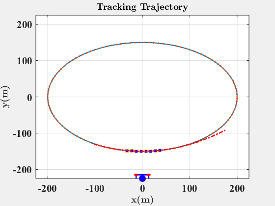
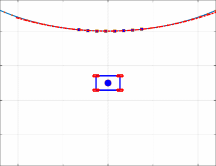

# Self-Driving Car Simulation In MATLAB
This repository contains a series of self-driving car simulations in MATLAB. The code associated with each of simulations are categorized in different folders. The code is standalone and should run on any MATLAB version without requiring additional dependencies. The simulations are listed below:
# 1. Tracking a Trajectory
 

# 2. A Hybrid Automaton Design
The dynamics of the car is implemented and a PID controller drives the car towards the specified Goal while avoiding the obstacle in the map.
The dynamics of the car and the controller are all implanted in Car.m file using object-oriented programming in MATLAB. The main function runs the car model and plots the results to generate the GIF file for this simulation.

